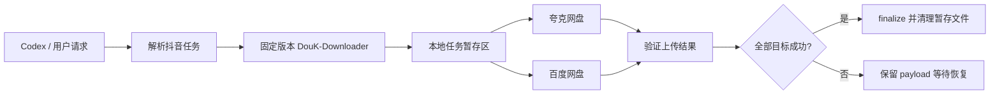

# douyin-cloud-download

[English](README_EN.md)

面向 Codex 的抖音媒体下载与网盘归档 Skill 套件。将用户已经有权访问的抖音视频、图文、实况照片、账号作品、收藏、收藏夹、收藏音乐和直播内容下载到本地暂存区，再归档到 **夸克网盘、百度网盘或两者同时归档**。

> 当前产品版本：`1.0.0`
>
> 正式支持：Windows x86_64、Linux x86_64（Ubuntu / Debian）
>
> 项目只处理用户拥有或已经获授权保存的内容，不提供付费或私密内容绕过。

## 主要能力

| 能力 | 状态 | 说明 |
| --- | --- | --- |
| 单条/批量抖音作品 | ✅ | 视频、图文、实况照片 |
| 账号作品 | ✅ | 支持作品范围与日期限制 |
| 收藏 / 收藏夹 / 收藏音乐 | ✅ | 支持恢复中断任务 |
| 直播录制 | ✅ | 需要 ffmpeg |
| 夸克网盘归档 | ✅ | 使用固定审核版本的官方 Skill |
| 百度网盘归档 | ✅ | 使用固定审核版本的官方 Skill |
| 双网盘归档 | ✅ | 两端全部成功后才清理本地暂存文件 |
| Windows / Linux | ✅ | 共用同一套 Python 控制器 |
| 升级 / 回滚 / 诊断 | ✅ | 带版本快照、Schema 迁移和脱敏诊断包 |

归档目录固定为：

```text
./抖音下载/[作者]/
```

## 工作流程



每个任务都有独立 job 状态。下载、上传和清理是分开的阶段；任何一个目标网盘失败时，本地 payload 都会保留，可继续恢复或只重试失败的一端。

## 固定上游版本

项目不会在安装或升级时自动追随上游 `master`。当前审核并锁定：

| 组件 | 固定版本 |
| --- | --- |
| DouK-Downloader | `df8aced70e476ae3330fa913186f3207b4843201` |
| 夸克官方 Skill | `1.0.19` |
| 百度官方 Skill | `v1.7.5` |

具体来源、允许域名和 SHA256 记录在 [`UPSTREAMS.lock.json`](UPSTREAMS.lock.json)。`check-upstreams` 只检查是否出现新版本，不会自动更新锁定内容。

## 环境要求

基础依赖：

- Python `3.12`
- Git
- [uv](https://github.com/astral-sh/uv)
- Node.js
- Bash
- ffmpeg（仅直播录制需要）

Windows 使用 Git for Windows 自带的 Git Bash；Linux 正式支持 Ubuntu / Debian x86_64。

如果设置了 `CODEX_HOME`，安装器会使用该目录；否则：

```text
Windows: %USERPROFILE%\.codex
Linux:   $HOME/.codex
```

## 快速安装

克隆仓库：

```bash
git clone https://github.com/EatTake/douyin-cloud-download.git
cd douyin-cloud-download
```

### Windows

```powershell
Set-ExecutionPolicy -Scope Process Bypass
.\scripts\install.ps1 -Onboard -QuickStart
```

### Linux

```bash
bash ./scripts/install.sh --onboard --quick-start
```

如需同时安装百度 CLI：

```powershell
.\scripts\install.ps1 -Onboard -QuickStart -InstallBaiduCli
```

```bash
bash ./scripts/install.sh --onboard --quick-start --install-baidu-cli
```

## 首次配置

单独运行首次配置流程：

```powershell
# Windows
.\scripts\onboard.ps1 -Drive both -QuickStart
```

```bash
# Linux
bash ./scripts/onboard.sh --drive both --quick-start
```

Douyin Cookie 在本地交互终端内配置；夸克和百度认证交给各自官方 Skill / CLI 流程。Cookie、Token、BDUSS、STOKEN 等凭据不会写入任务清单。

安装和升级会保留现有用户状态，包括 DouK `Volume/`、可选 `encipher.py`、任务和历史记录、夸克 `codex/` 登录配置及百度现有认证/配置。

## 在 Codex 中使用

安装完成后，可以直接描述目标，例如：

```text
把这个抖音视频下载并保存到夸克网盘
把这几个抖音链接下载后同时保存到夸克和百度网盘
下载这个账号最近一个月的作品到百度网盘
把我的这个收藏夹保存到夸克网盘
录制这个正在直播的抖音直播并保存到两个网盘
```

Skill 会根据请求建立任务、调用固定版本的下载运行时、完成网盘交接并验证状态。

## 命令行维护

统一维护入口：

```text
python3.12 scripts/setup.py install
python3.12 scripts/setup.py onboard --drive both
python3.12 scripts/setup.py doctor
python3.12 scripts/setup.py doctor --bundle
python3.12 scripts/setup.py repair
python3.12 scripts/setup.py upgrade
python3.12 scripts/setup.py check-upstreams
python3.12 scripts/setup.py versions
python3.12 scripts/setup.py rollback [SNAPSHOT_ID]
python3.12 scripts/setup.py cleanup-old-versions --keep 2
```

Windows 可将 `python3.12` 换成 `py -3.12`。

### 升级与回滚

`upgrade` 会按顺序执行：

1. 环境预检。
2. 备份任务 Schema 元数据。
3. 创建当前 Skills 与 DouK 运行时的持久化快照。
4. 迁移旧任务清单到当前 Schema。
5. 安装 `UPSTREAMS.lock.json` 中已经审核的版本。
6. 安装失败时自动恢复升级前快照。

默认保留最近两个旧版本快照。手动查看和回滚：

```text
python3.12 scripts/setup.py versions
python3.12 scripts/setup.py rollback SNAPSHOT_ID
```

回滚恢复程序和 DouK 运行时，同时保留当前 Cookie、网盘认证和其他可变用户状态。

## 任务恢复

查看任务：

```text
python skills/douyin-cloud-download/scripts/douyin_cloud.py show-job --job JOB_ID
```

恢复状态：

```text
python skills/douyin-cloud-download/scripts/douyin_cloud.py recover --job JOB_ID
```

继续中断的下载：

```text
python skills/douyin-cloud-download/scripts/douyin_cloud.py resume-download --job JOB_ID
```

系统只有在所有请求的网盘都被标记为上传成功后，才允许 `finalize` 删除本地暂存 payload。

## 诊断与错误协议

基础检查：

```text
python3.12 scripts/setup.py doctor
```

生成可分享的脱敏诊断包：

```text
python3.12 scripts/setup.py doctor --bundle
```

诊断包包含环境信息、运行时完整性、近期轮转日志、任务清单和发布元数据，并自动脱敏 Cookie、Authorization、access/refresh token、BDUSS、STOKEN 和 URL。

核心错误同时提供稳定的 `DCD-*` 错误码，以及：

```text
error_code
cause
retryable
recovery
```

旧版顶层 `error` 字段继续保留，避免破坏已有调用方。

## 安全与完整性

- DouK 使用固定 commit，并校验运行时 SHA256 清单。
- 夸克安装包必须来自允许的 HTTPS 域名，版本和 SHA256 必须与锁文件一致。
- 百度安装器缺少可信校验值或校验工具时直接终止安装。
- GitHub Actions 使用固定 commit SHA。
- 升级不会自动采用未经人工审核的新上游版本。
- 任务清单不保存 Cookie、网盘凭据或签名媒体 URL。

## 项目结构

```text
.
├─ scripts/
│  ├─ setup.py                 # 跨平台安装、升级、回滚、诊断控制器
│  ├─ install.ps1 / install.sh
│  ├─ onboard.ps1 / onboard.sh
│  └─ dcd_setup/               # release / migration / rollback 模块
├─ skills/
│  ├─ douyin-cloud-download/   # 主 Skill 与任务控制器
│  └─ baidu-drive/             # 固定版本百度 Skill
├─ vendor/TikTokDownloader/    # 固定 DouK 上游源码快照
├─ VERSION
├─ UPSTREAMS.lock.json
└─ CHANGELOG.md
```

更详细的行为约束和命令见：

- [`skills/douyin-cloud-download/SKILL.md`](skills/douyin-cloud-download/SKILL.md)
- [`skills/douyin-cloud-download/references/setup.md`](skills/douyin-cloud-download/references/setup.md)
- [`CHANGELOG.md`](CHANGELOG.md)

## 验证

项目的自动检查覆盖环境、路径、版本锁、运行时完整性、Schema 迁移、回滚、错误协议和诊断脱敏。真实抖音访问以及夸克/百度登录和上传质量仍建议人工验收。

```powershell
py -3.12 skills/douyin-cloud-download/tests/test_douyin_cloud.py
py -3.12 skills/douyin-cloud-download/tests/test_setup_controller.py
py -3.12 skills/douyin-cloud-download/tests/test_product_maturity.py
py -3.12 scripts/setup.py check-upstreams
```

## 许可证与第三方组件

DouK-Downloader 以 GPL-3.0 上游源码快照形式保存在 `vendor/TikTokDownloader`，许可证见 [`vendor/TikTokDownloader/license`](vendor/TikTokDownloader/license)。其他第三方组件、来源和许可边界见 [`THIRD_PARTY_NOTICES.md`](THIRD_PARTY_NOTICES.md)。

本项目仅用于保存你拥有或已经获授权保存的内容。
